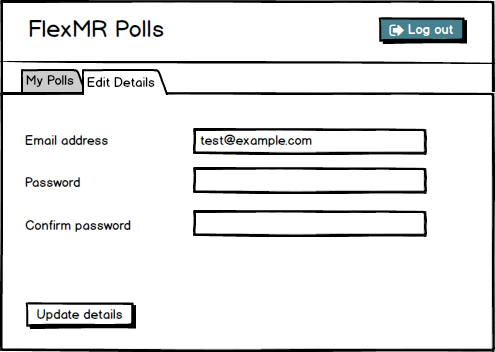

# Flex Poll 

## Setup

First, run:

```
bundle install
rake db:setup
```

This will allow you to run the rails server locally with:

`rails s` 

And run the test suite with:

`rake test`

A seeds file is provided to help explore and test the application. Factories can be found in `test/factories.rb`.


## Todo

* Users don't currently have a way of being able to change their email address and password. Please add this functionality, a wireframe suggestion of the UI is below:


* We need users to be able to comment on polls after they've provided an answer. The unit tests for this have been written, the feature just needs to be implemented and the controller tests added if appropriate. 

* The tests for the Polls are playing up a bit, please take a look and fix anything that's not working correctly.

* The polls would benefit from a couple of UI tweaks:
  * On the poll response page, make the form wide enough so that the label and radio button don't have a line break.
  * On the same page, it'd be helpful if the poll question was displayed to the user rather than just the options.
  * On the `polls/new` page, 'Add another option' is a bit confusing when a first option hasn't yet been added. Please change it so the text first says 'Add first option', then says 'Add another option' once an initial option has been provided.
  * The `root` Url just shows a link to the polls index page. Let's save our users a click and have the root_url automatically take them to the polls index.
  * On the polls index, let's show a message along the lines of "There are currently no polls" if there aren't any suitable polls for the user.
